# 📱 ShiftMote — Evrensel IR Kumanda Uygulaması

<p align="center">
  <a href="https://flutter.dev/">
    
  </a>
  <a href="https://dart.dev/">
    
  </a>
  <a href="https://developer.android.com/reference/android/hardware/ConsumerIrManager">
    
  </a>
  <a href="https://github.com/probonopd/irdb">
    
  </a>
  <a href="https://pub.dev/packages/go_router">
    
  </a>
</p>

> Telefonunun içindeki IR (kızılötesi) LED'i gerçek bir kumandaya dönüştüren, **tamamen çevrimdışı çalışan** evrensel kumanda uygulaması. 643 marka, 3.200+ cihaz modeli — internet yok, API anahtarı yok, hesap yok.

---

## 📋 Proje Hakkında

**ShiftMote**, IR blaster donanımına sahip Android telefonları (Xiaomi, Redmi, POCO, Huawei vb.) evrensel bir kumandaya dönüştürür. Televizyon, klima, projeksiyon, ses sistemi ve daha birçok cihaz tek uygulamadan kontrol edilir.

Uygulama, açık kaynak **probonopd/irdb** veritabanını uygulama içine gömülü olarak taşır: ilk açılışta arşiv telefona çıkarılır ve o andan itibaren her şey çevrimdışı çalışır. IR sinyalleri, pub.dev'deki hazır paketlere güvenmek yerine **sıfırdan yazılmış native Kotlin köprüsü** (`MethodChannel` → `ConsumerIrManager`) ile üretilir; NEC'den RC6'ya, Sony SIRC'ten Kaseikyo'ya kadar yaygın tüm IR protokolleri uygulama içindeki encoder motoruyla kodlanır.

- **Framework**: Flutter (Dart 3) — yalnızca Android
- **Mimari**: Sayfa başına `mantık + view` ayrımı, Provider ile state yönetimi
- **Routing**: go_router — `StatefulShellRoute.indexedStack` + 3 sekmeli özel alt navigasyon
- **Tasarım**: Neumorphic koyu tema (flutter_neumorphic_plus) + altın vurgu rengi + Inter yazı tipi
- **IR Katmanı**: Native Kotlin `ConsumerIrManager` köprüsü (`shiftmote/ir` MethodChannel)
- **IR Veritabanı**: probonopd/irdb (uygulamaya gömülü `irdb.tar.gz`, ~712 KB)
- **Depolama**: shared_preferences (kumandalar + odalar JSON olarak)
- **Lokalizasyon**: easy_localization — Türkçe + İngilizce (YAML)

---

## 🖼️ Ekran Görüntüleri

### 1. Ana Sayfa
Odalar karuseli ve tüm cihazların listesi tek ekranda. Cihaz sayısı rozeti, saate göre değişen karşılama mesajı, favori yıldızı ve her cihaz için yeniden adlandır/sil menüsü. Depo değiştiğinde liste otomatik yenilenir.

<p align="center">
  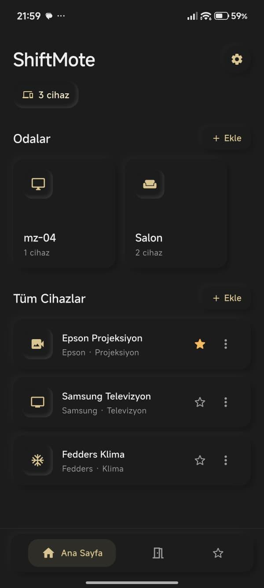<br/>
  <em>Ana Sayfa — Odalar ve Tüm Cihazlar</em>
</p>

### 2. Odalar ve Oda Detayı
Cihazlar odalara gruplanır (Salon, Yatak Odası, Ofis... 10 hazır oda ikonu). Oda detayında o odadaki cihazlar listelenir; oda silinse bile cihazlar kaybolmaz.

<p align="center">
  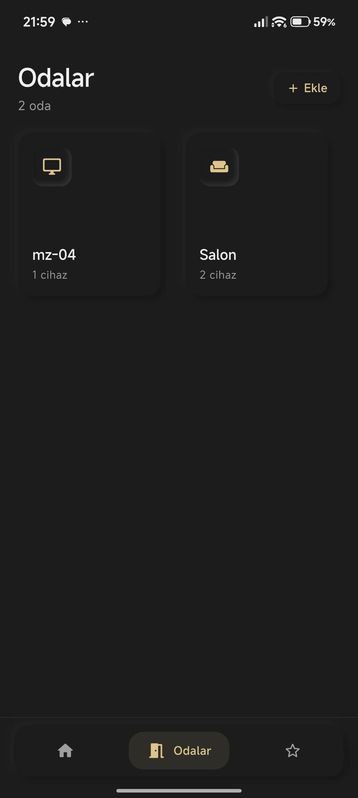
  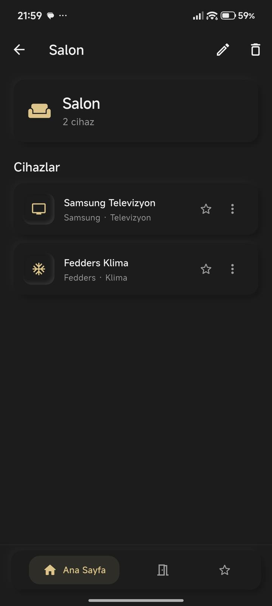
  <br/>
  <em>Odalar Listesi ve Salon Oda Detayı</em>
</p>

### 3. Favoriler
En sık kullanılan cihazlar yıldızlanarak ayrı sekmede toplanır. Alt navigasyondan tek dokunuşla erişilir.

<p align="center">
  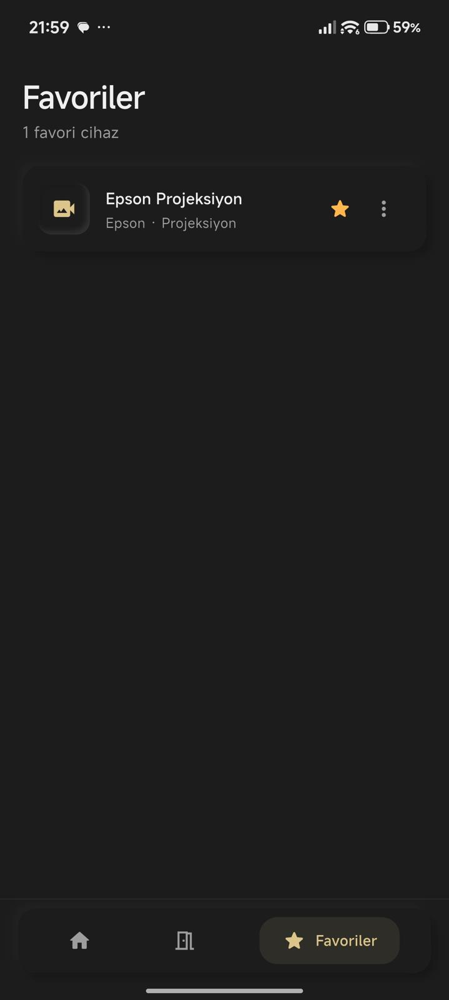<br/>
  <em>Favoriler Sayfası</em>
</p>

### 4. Kumanda Ekleme — Cihaz Türü Seçimi ve Test Sihirbazı
Xiaomi Mi Remote tarzı 11 kategorili cihaz türü ekranı. Marka seçildikten sonra **"Cihazını Dene"** sihirbazı devreye girer: her model için güç sinyali gönderilir, cihaz tepki verirse "Evet" ile kumanda kaydedilir, vermezse "Hayır" ile sıradaki uyumlu modele geçilir.

<p align="center">
  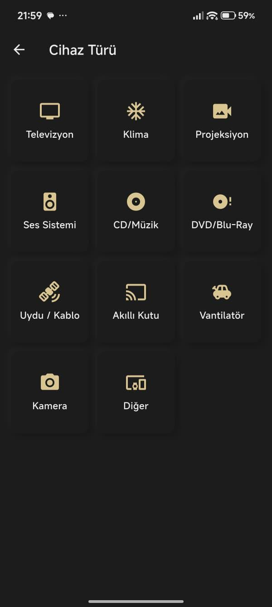
  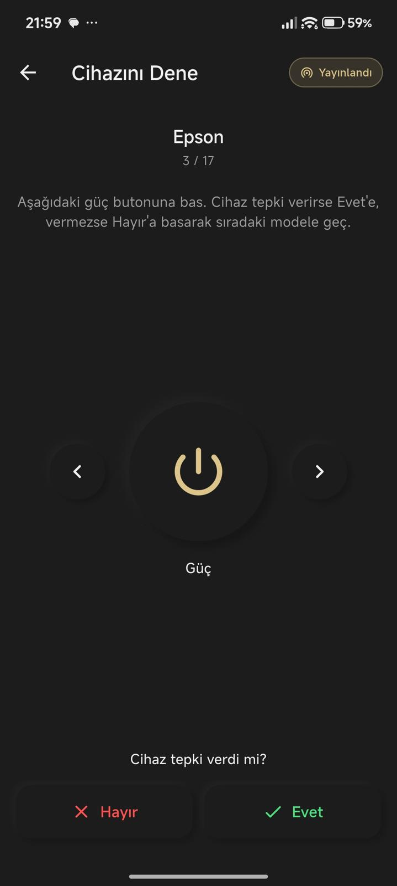
  <br/>
  <em>Cihaz Türü Seçimi ve "Cihazını Dene" Test Sihirbazı</em>
</p>

### 5. Cihaza Özel Kumanda Ekranları
Her cihaz türü kendi arayüzünü alır: TV için numpad + kanal/ses, klima için sürüklenebilir sıcaklık arkı (16–30°C) + mod ve fan hızı, projeksiyon için kaynak seçici (HDMI/VGA/USB) + zoom. AppBar'daki **IR göstergesi** sinyalin durumunu canlı bildirir (IR Hazır → Yayınlandı).

<p align="center">
  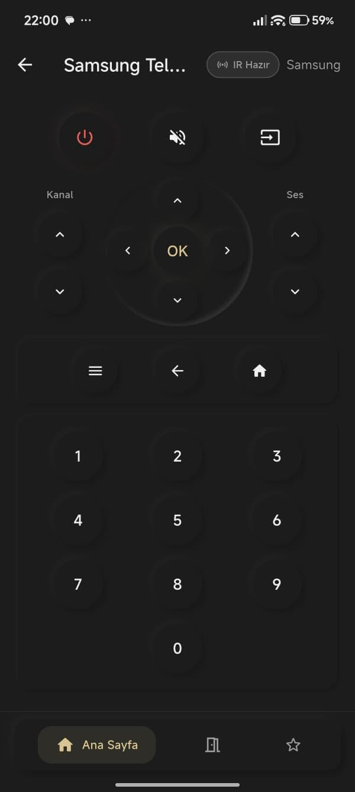
  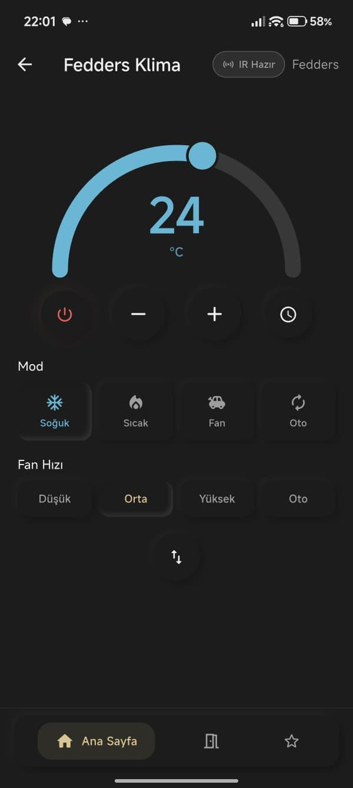
  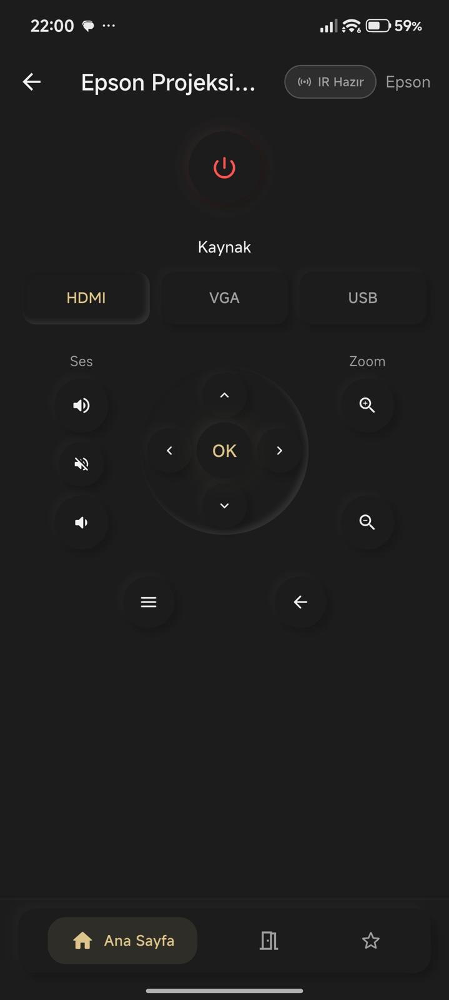
  <br/>
  <em>Samsung TV, Fedders Klima ve Epson Projeksiyon Kumandaları</em>
</p>

### 6. Ayarlar ve Hakkında
Dil seçimi (Türkçe/İngilizce) ve uygulama bilgileri. Hakkında ekranında kullanılan açık veritabanı ve IR donanım gereksinimi belirtilir.

<p align="center">
  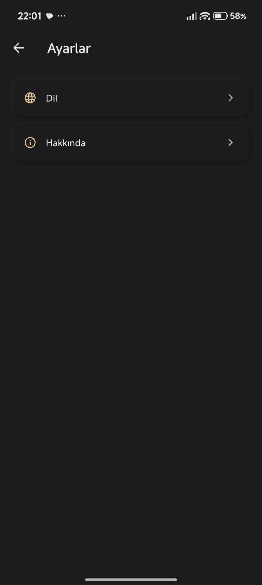
  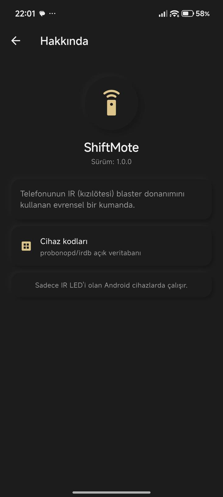
  <br/>
  <em>Ayarlar ve Hakkında Sayfaları</em>
</p>

---

## 🔴 IR Motoru — Native Köprü ve Protokol Encoder'ları

Bu projenin teknik kalbi: pub.dev'de güncel bir IR paketi bulunmadığı için IR iletimi **sıfırdan yazılmış native köprü** ile yapılır.

### Nasıl Çalışır?

1. Kullanıcı bir tuşa basar → CSV'den gelen komut (`protocol, device, subdevice, function`) bulunur
2. **Protokol encoder'ı** komutu mikrosaniye cinsinden aç/kapa desenine (pattern) ve taşıyıcı frekansa çevirir
3. `shiftmote/ir` MethodChannel üzerinden Kotlin tarafına iletilir
4. `ConsumerIrManager.transmit(frequency, pattern)` sinyali telefonun IR LED'inden yayınlar
5. AppBar'daki **IR göstergesi** durumu bildirir: ⚪ IR Hazır → 🟡 Yayınlandı → (hata halinde) 🔴 Hata / 🟠 IR Yok

### Desteklenen IR Protokolleri (14 Encoder Ailesi, 20+ Protokol)

| Protokol Ailesi | Varyantlar | Frekans |
|-----------------|-----------|---------|
| **NEC** | NEC, NEC1, NEC2, NEC1-F16, NEC2-F16, NEC1-RNC | 38 kHz |
| **NECx** | NECX, NECX1, NECX2 (Samsung TV'lerin çoğu) | 38 kHz |
| **Pioneer** | NEC1 tabanlı | 40 kHz |
| **Sony SIRC** | SONY12, SONY15, SONY20 (3 tekrarlı çerçeve) | 40 kHz |
| **Philips RC5** | RC5, RC5X (Manchester kodlama) | 36 kHz |
| **Philips RC6** | RC6, MCE (Media Center) | 36 kHz |
| **Panasonic / Kaseikyo** | PANASONIC, PANASONIC_OLD | 37 kHz |
| **JVC** | JVC | 38 kHz |
| **Denon** | DENON, DENON-K | 38 kHz |
| **Sharp** | SHARP | 38 kHz |
| **Mitsubishi** | MITSUBISHI | ~33 kHz |
| **Aiwa** | AIWA | 38 kHz |
| **Samsung** | SAMSUNG, SAMSUNG36 | 38 kHz |
| **RECS80** | RECS80 | 38 kHz |

Encoder'lar hifi-remote.com **DecodeIR / IRP notasyonu** referans alınarak yazılmıştır (`lib/ir/irdb_parser.dart`).

### Xiaomi HyperOS / MIUI Özel Desteği

Modern Android'de gerekmese de, Xiaomi **HyperOS** ve MIUI cihazlar üçüncü parti uygulamaların IR kullanımında eski `TRANSMIT_IR` iznini kontrol eder — izin manifest'te yoksa `SecurityException` fırlatılır. ShiftMote bu izni bildirir ve IR göstergesine dokunulduğunda açılan **IR Tanı** diyaloğu ile sorun ayıklamayı kolaylaştırır (*"Mi Remote çalışıyorsa donanım var, sorun izindedir"* yönlendirmesi + panoya kopyalanabilir tanı raporu).

---

## 📚 IR Kod Veritabanı — probonopd/irdb

- Açık kaynak **probonopd/irdb** veritabanı `assets/irdb.tar.gz` (~712 KB) olarak uygulamaya gömülüdür
- **643 marka klasörü**, **3.244 cihaz modeli CSV dosyası**
- İlk açılışta arşiv `GZip + Tar` decoder ile uygulama belgeler dizinine (`irdb/v1/`) **bir kez** çıkarılır — `.ok` işaret dosyası sayesinde sonraki açılışlar beklemez
- CSV formatı: `functionname, protocol, device, subdevice, function` → dosya adı cihaz kodunu taşır (`7,7.csv`)
- Komut adları normalize edilerek eşleştirilir: `VOLUME +`, `VOL_UP`, `KEY_VOLUMEUP` gibi farklı yazımlar ve veritabanındaki yazım hataları (`CURSER DOWN` vb.) tek komuta bağlanır

---

## 🧙 Kumanda Ekleme Sihirbazı (4 Adım)

| Adım | Ekran | Ne Olur? |
|------|-------|----------|
| 1 | **Kategori** | 11 cihaz türünden biri seçilir (Xiaomi tarzı grid) |
| 2 | **Marka** | Arama kutusu + popüler marka çipleri (TV için Samsung, LG, Sony, Vestel...) |
| 3 | **Cihazını Dene** | Her aday model için güç sinyali gönderilir → *"Cihaz tepki verdi mi?"* → **Evet** kumandayı seçer, **Hayır** sıradaki modele geçer |
| 4 | **İsim** | `"<Marka> <Kategori>"` otomatik önerilir, istenirse oda ataması yapılır |

Sihirbazın akıllı tarafları:

- **Güç komutu bulma önceliği**: kesin `POWER` eşleşmesi → `PWR/POWER` içeren → `ON/OFF` varyantları → klima mod komutları (`COOL/HEAT/AUTO`) → ilk komut (aynı CSV'deki tüm komutlar aynı cihaz kodunu paylaştığı için test yine geçerlidir)
- **Yalnızca çalıştırılabilir modeller listelenir**: güç komutunun protokolü encoder motorunca desteklenmeyen modeller elenir — kullanıcı asla "ölü" model denemez

---

## 🎛️ Cihaza Özel Kumanda Ekranları

Kumanda açıldığında cihazın kategorisine göre doğru arayüz yüklenir:

| Ekran | Cihaz Türü | Özellikler |
|-------|-----------|------------|
| **TvRemote** | Televizyon | Güç, kaynak, sessiz, kanal/ses rocker'ları, D-pad + OK, menü/geri/ana ekran, 0-9 numpad |
| **AcRemote** | Klima | Sürüklenebilir sıcaklık arkı (**16–30°C**), 4 mod (Soğuk/Sıcak/Fan/Oto — her biri kendi renginde), 4 fan hızı, zamanlayıcı, kanat yönü |
| **ProjektorRemote** | Projeksiyon | Kaynak seçici (**HDMI / VGA / USB**), zoom +/-, ses/sessiz, D-pad + OK, menü |
| **GenericRemote** | Diğer tümü | **Komut sınıflandırıcı** CSV'deki komutları analiz eder; güç, ses/kanal, D-pad, oynatma, renk tuşları, sayılar, vantilatör ekstraları (salınım, zamanlayıcı, ışık) ve "Diğer Komutlar" bölümlerini yalnızca komut varsa dinamik oluşturur |

---

## 🏠 Oda ve Favori Sistemi

- **Odalar**: Cihazlar odalara gruplanır; 10 hazır oda ikonu (Salon, Yatak Odası, Mutfak, Ofis, Banyo, Çocuk Odası, Yemek Odası, Garaj, Toplantı Odası, Balkon)
- **Favoriler**: Herhangi bir cihaz yıldızlanarak Favoriler sekmesine eklenir
- **3 sekmeli alt navigasyon**: Ana Sayfa • Odalar • Favoriler — dokunmatik geri bildirimli (haptic), genişleyen aktif sekme animasyonlu
- **Otomatik yenileme**: Kumanda/oda depoları `ValueNotifier` yayınlar; ana sayfa hem depo değişimini hem uygulamanın öne gelmesini (`AppLifecycleState.resumed`) dinleyerek listeyi günceller

---

## 📺 11 Cihaz Kategorisi

| Kategori | Popüler Markalar |
|----------|------------------|
| 📺 Televizyon | Samsung, LG, Sony, Vestel, Philips, Panasonic, Toshiba, Sharp, Hisense, TCL |
| ❄️ Klima | Mitsubishi, Daikin, LG, Samsung, Panasonic, Toshiba, Carrier, Vestel, Bosch, Beko |
| 📽️ Projeksiyon | Epson, BenQ, Sony, NEC, Panasonic, ViewSonic, Optoma, Hitachi, Acer, HP |
| 🔊 Ses Sistemi | Sony, Yamaha, Denon, Onkyo, Pioneer, Marantz, JBL, Bose, Harman |
| 💿 CD/Müzik | CD çalar, kaset, MP3, iPod dock cihazları |
| 📀 DVD/Blu-Ray | DVD, Blu-Ray, HD DVD, Laser Disc, VCR |
| 📡 Uydu / Kablo | Uydu alıcı, kablo kutusu, DVB-T, decoder |
| 📦 Akıllı Kutu | Apple TV, Roku, Amazon, Google |
| 🌀 Vantilatör | Vestel, Hunter, Casablanca |
| 📷 Kamera | Fotoğraf makinesi, video kamera |
| ➕ Diğer | Kalan tüm irdb klasörleri (otomatik) |

Kategoriler, irdb'nin ~1.400 ham klasör adını kullanıcı dostu 11 gruba eşler (`lib/ir/cihaz_kategorileri.dart`).

---

## 🛠️ Kullanılan Teknolojiler

### Flutter Katmanı

| Teknoloji | Açıklama |
|-----------|----------|
| **Flutter / Dart 3** | Uygulama çatısı (yalnızca Android) |
| **go_router** | `StatefulShellRoute.indexedStack` ile sekmeli navigasyon |
| **provider** | Sayfa bazlı state yönetimi (mantık/view ayrımı) |
| **flutter_neumorphic_plus** | Neumorphic koyu tema bileşenleri |
| **google_fonts** | Inter yazı tipi |
| **easy_localization** | TR/EN çeviri (YAML dosyaları) |
| **shared_preferences** | Kumanda ve oda kayıtları (JSON) |
| **archive** | irdb.tar.gz çıkarma (GZip + Tar) |
| **path_provider / path** | Uygulama belgeler dizini yönetimi |

### Native Katman (Kotlin)

| Bileşen | Açıklama |
|---------|----------|
| **MethodChannel `shiftmote/ir`** | Flutter ↔ Android köprüsü (`hasIrEmitter`, `transmit`) |
| **ConsumerIrManager** | Android'in IR blaster API'si — frekans + mikrosaniye deseni yayını |
| **TRANSMIT_IR izni** | Xiaomi HyperOS/MIUI uyumluluğu için manifest bildirimi |
| **Tanı logları** | Üretici/model/SDK bilgisiyle IR sorunlarını ayıklama |

### Veri

| Kaynak | Açıklama |
|--------|----------|
| **probonopd/irdb** | 643 marka, 3.244 model — açık kaynak IR kod veritabanı |
| **DecodeIR / IRP** | Protokol encoder'larının referans spesifikasyonu |

---

## 🚀 Kurulum

### Gereksinimler

- **Flutter** 3.22+ (Dart SDK ≥ 3.4.3)
- **IR blaster'lı fiziksel Android telefon** (Xiaomi/Redmi/POCO çoğu modelde var) — emülatör ve iOS **desteklenmez**
- İnternet, API anahtarı veya hesap **gerekmez** — uygulama tamamen çevrimdışı çalışır

### Adımlar

```bash
# Depoyu klonlayın
git clone https://github.com/BurakYucelPY/ShiftMote.git
cd ShiftMote

# Bağımlılıkları yükleyin
flutter pub get

# Telefonu USB ile bağlayıp çalıştırın
flutter run
```

İlk açılışta irdb arşivi telefona çıkarılır (birkaç saniye), sonraki açılışlar anında yüklenir.

---

## 📁 Proje Yapısı

```
ShiftMote/
├── lib/
│   ├── main.dart                          # Bootstrap: lokalizasyon + depolar + irdb + tema
│   ├── Route/
│   │   ├── routing.dart                   # go_router yapısı (shell + detay rotaları)
│   │   ├── branches.dart                  # 3 sekme: Anasayfa, Odalar, Favoriler
│   │   └── identify_routes.dart           # Rota sabitleri
│   ├── ir/
│   │   ├── ir_servis.dart                 # IR gönderim + durum bildirimi (ValueNotifier)
│   │   ├── irdb_parser.dart               # CSV parser + 14 protokol encoder'ı
│   │   ├── irdb_bootstrap.dart            # irdb.tar.gz tek seferlik çıkarma
│   │   ├── cihaz_kategorileri.dart        # 11 kategori + popüler marka listeleri
│   │   ├── komut_siniflandirici.dart      # Komutları UI bölümlerine sınıflandırma
│   │   └── uzaktan_komut.dart             # Komut alias/normalizasyon eşleştirme
│   ├── db/
│   │   ├── kumanda_deposu.dart            # Kumanda CRUD + favori + oda ataması
│   │   └── oda_deposu.dart                # Oda CRUD
│   ├── models/
│   │   ├── oda_ikonlari.dart              # 10 oda ikonu tanımı
│   │   └── kategori_ikonu.dart            # Kategori → ikon eşlemesi
│   ├── screens/
│   │   ├── Anasayfa/                      # Ana sayfa (odalar karuseli + cihaz listesi)
│   │   ├── KumandaEkle/                   # 4 adımlı kumanda ekleme sihirbazı
│   │   ├── Kumanda/                       # kumanda_view + tv/ac/projektor/generic remote
│   │   ├── Odalar/                        # Oda listesi + oda detayı
│   │   ├── OdaEkle/                       # Oda oluşturma (isim + ikon)
│   │   ├── Favoriler/                     # Favori cihazlar
│   │   ├── Ayarlar/                       # Ayarlar + Dil alt sayfası
│   │   └── Hakkında/                      # Uygulama bilgisi
│   ├── theme/
│   │   ├── app_theme.dart                 # Neumorphic koyu tema + renk paleti
│   │   └── modern_presets.dart            # Alternatif düz Material preset'leri
│   └── widgets/
│       ├── neu_button.dart                # Neumorphic basılabilir buton
│       ├── ir_gosterge.dart               # IR durum çipi + IR Tanı diyaloğu
│       ├── custom_bottom_nav.dart         # 3 sekmeli animasyonlu alt bar
│       ├── device_tile.dart               # Cihaz satırı (favori/yeniden adlandır/sil)
│       ├── room_card.dart                 # Oda kartı
│       └── ...                            # glass_container, pulse_indicator vb.
├── android/
│   └── app/src/main/
│       ├── kotlin/.../MainActivity.kt     # ConsumerIrManager MethodChannel köprüsü
│       └── AndroidManifest.xml            # consumerir feature + TRANSMIT_IR izni
├── assets/
│   ├── irdb.tar.gz                        # Gömülü IR kod veritabanı (~712 KB)
│   └── translations/                      # tr.yaml + en.yaml
└── pubspec.yaml
```

---

## 💡 Nasıl Çalışır?

### 1. Açılış
Lokalizasyon, kumanda/oda depoları ve irdb hazırlanır. İlk kurulumda `irdb.tar.gz` uygulama dizinine çıkarılır; `.ok` işareti sayesinde bu işlem yalnızca bir kez yapılır.

### 2. Kumanda Ekleme
Kategori → marka → test sihirbazı akışı tamamlanır. Sihirbaz yalnızca protokolü desteklenen modelleri listeler, kullanıcı güç tuşuyla gerçek cihazını test ederek doğru modeli bulur.

### 3. Kumanda Kullanımı
Cihaz kategorisine uygun kumanda ekranı açılır. Basılan her tuş, CSV'deki komutun protokol encoder'ından geçirilip native köprü üzerinden IR LED'e iletilir. IR göstergesi her gönderimi anlık doğrular.

### 4. Organizasyon
Cihazlar odalara taşınır, sık kullanılanlar favorilere eklenir. Tüm veriler telefonda JSON olarak saklanır — bulut yok, hesap yok.

### 5. Sorun Anında
IR göstergesi hata durumunda kırmızıya döner; dokununca açılan IR Tanı diyaloğu cihaz bilgilerini toplar ve Xiaomi izin kısıtlamaları için yönlendirme sunar.

---

## 🐛 Sorun Giderme

| Sorun | Çözüm |
|-------|-------|
| **"IR Yok" göstergesi** | Telefonda IR blaster donanımı yok — IR LED'li bir Android cihaz gerekir |
| **Xiaomi'de sinyal gitmiyor (`SecurityException`)** | HyperOS/MIUI `TRANSMIT_IR` iznini arar; uygulama manifest'te bildirir, yine de sorun varsa sistem ayarlarından uygulama izinlerini kontrol edin |
| **Cihaz güç tuşuna tepki vermiyor** | Test sihirbazında "Hayır" ile sıradaki modele geçin — aynı markanın farklı model kodları denenir |
| **Mi Remote çalışıyor ama ShiftMote çalışmıyor** | Donanım sağlam demektir; sorun izin katmanındadır — IR Tanı diyaloğundaki raporu kullanın |
| **Komutlar eksik görünüyor** | GenericRemote yalnızca CSV'de bulunan komutları gösterir; eksik tuşlar veritabanı kaydından kaynaklanır |
| **İlk açılış yavaş** | irdb arşivi bir kez çıkarılıyordur; sonraki açılışlar anındadır |

---

## 📌 Notlar

- **Tamamen çevrimdışı**: Uygulama hiçbir ağ isteği yapmaz; IR veritabanı gömülüdür, API anahtarı gerekmez.
- **Tema**: Koyu neumorphic tasarım (arka plan `#1C1C1C`, altın vurgu `#DCC48A`), dikey ekran kilidi.
- **Dil**: Türkçe (varsayılan) + İngilizce; `assets/translations/` altındaki YAML dosyalarıyla genişletilebilir.
- **Platform**: Yalnızca Android — `ConsumerIrManager` iOS'ta bulunmadığı için iOS desteklenmez.
- **IR kodları**: [probonopd/irdb](https://github.com/probonopd/irdb) topluluk veritabanından gelir; kod eksikse oraya katkı yapılabilir.

---

<p align="center">
  Made with 📱 by
  <a href="https://github.com/BurakYucelPY">Burak Yücel</a> •
  <a href="https://github.com/GurkanGurdal">Gürkan Gürdal</a>
</p>
